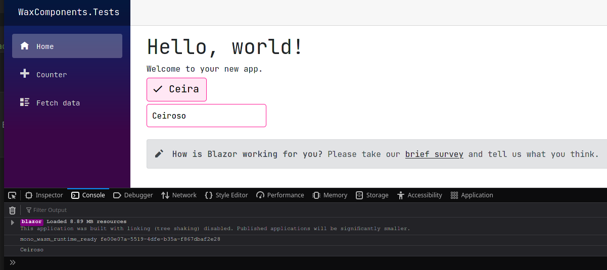

### Instalando

- Adicionar na head do html
```html
<!-- Estilos dos componentes-->
<link href="_content/WaxComponents/Styles/waxComponents.css" rel="stylesheet">

<!--Icones-->
<link href="https://fonts.googleapis.com/icon?family=Material+Icons" rel="stylesheet">
```

<br/>

### Usando

```html
<!--Button-->
<WaxButton OnClick="OnClick">
    
    <!--Icones baseados no tema Material-->
    <!--https://fonts.google.com/icons-->
    <Icon><WaxIcon Size="24px">done</WaxIcon></Icon>
    <Text>Ceira</Text>
</WaxButton>

<!--Text Input-->
<WaxTextInput @bind-Value="_text" Placeholder="Ceira"></WaxTextInput>
```

```c#
private string _text = String.Empty;

private void OnClick(object? sender, EventArgs e)
{
    Console.WriteLine(_text);
}
```

<br/>

### Resultado
